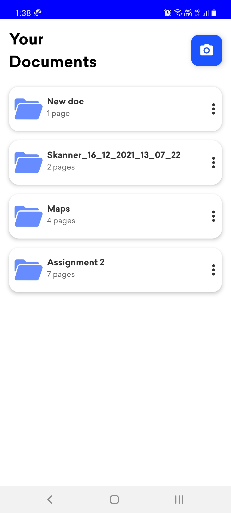
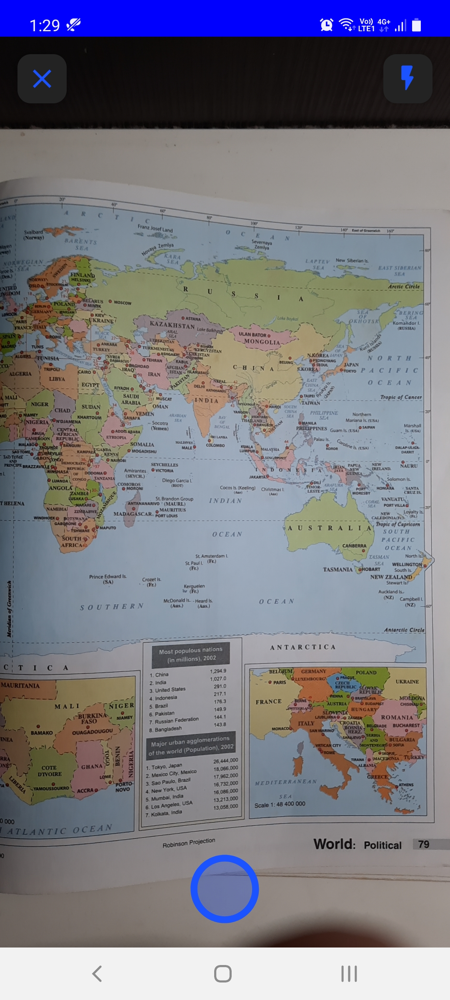
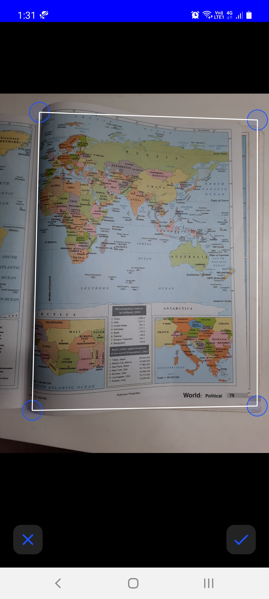
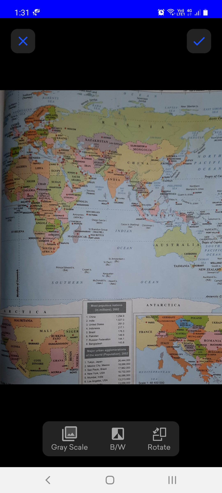
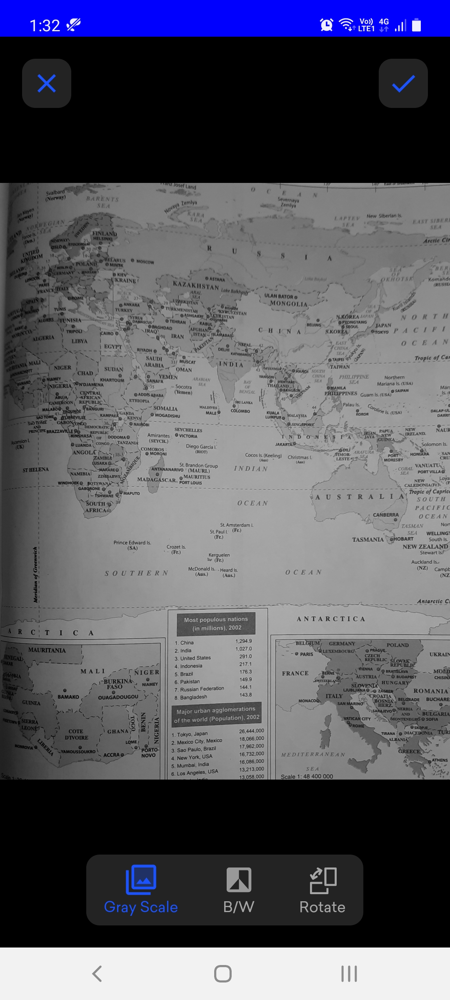
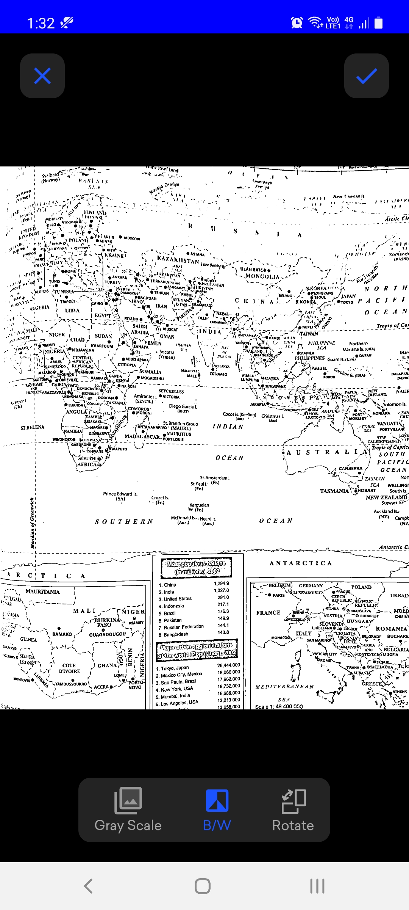
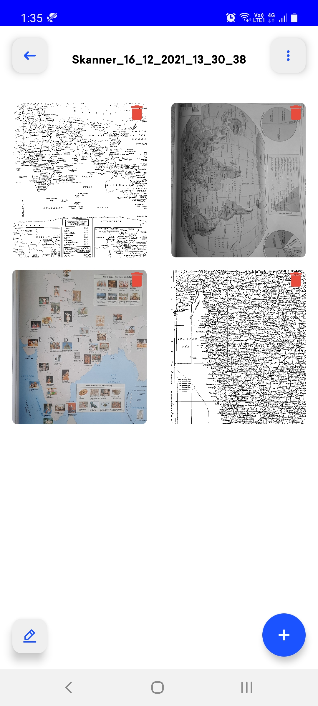
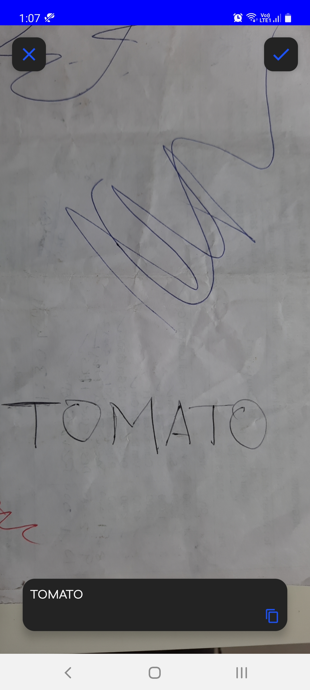

 
  

 

## Features
- Skanner is a scanning application used take images, make document and share as PDF.
- Automatically detect edges of taken image using OpenCV.
- Edge detected images can be further cropped to get perfect image.
- Images can be enhanced by adding grayscale, a B/W filter or rotate.
- Multiple images can be taken to make a document.
- Document name can be changed.
- Documents can be shared as PDF file on different applications.

## Screenshots
 

   <table align="center" border="0" >
  <tr>
    <td>
       <td></td>
     <td> </td>
    <td> </td>
  </table>
  

 

  <table align="center" border="0" >
  <tr>
    <td> </td>
     <td> </td>
     <td> </td>
     <td> </td>
  </tr>
</table>
  

 
